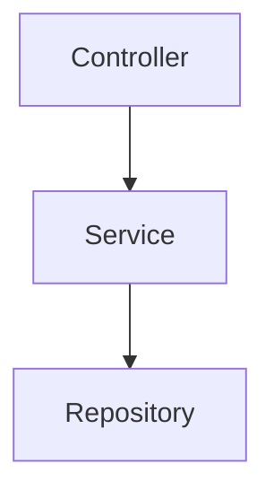

# Users Service
🚧 ***This service and its documentation are currently under development.*** Its architecture, APIs, features, and implementation details may change as development progresses.

The Users Service is responsible for managing user-related functionality within the application. It handles user data and account-related operations, including user registration, authentication, login, and profile management. The service communicates with the API Gateway through NestJS TCP transport.

## Responsibilities
The Users Service is responsible for managing user-related data and operations, including:

- User registration
- Fetching user data, both individually and in groups
- Updating user data
- Deleting users

Authentication and authorization are handled by the API Gateway rather than the Users Service.

## Message Patterns 
The Users Service communicates with the API Gateway using NestJS TCP microservice transport.

The following message patterns define the operations that can be requested by other services.

- `usersLogin`</br>
  Authenticate a user.
- `usersRegister`</br>
  Create a new account.
- `usersGetProfile`</br>
  Fetch the authenticated user's own data.
- `usersGetAll`</br>
  Fetch a list of users.
- `usersGetDetail`</br>
  Fetch an individual user data.
- `usersUpdate`</br>
  Update the authenticated user's own data.
- `usersDeleteForAdmin`</br>
  Delete a user's data by ID - `ADMIN ONLY`
- `usersDelete`</br>
  Delete the authenticated user's own account.

### Design Note
Some message patterns could technically be merged. For example, usersGetProfile and usersGetDetail both retrieve user data, while usersDelete and usersDeleteForAdmin both delete a user.

They are kept as separate message patterns to distinguish self-service operations from administrative operations and to make the Users Service's logs easier to understand and trace.

For self-service operations, the user ID is obtained from the authenticated user's JWT. For operations targeting another user, such as administrative deletion or retrieving a user's details, the ID is provided by the request.

## Enviromental Variables 
Each service contains its environment variables in a .env file. The .env file should be included in `.gitignore`, especially when the repository is public, to prevent sensitive information or credentials from being exposed.

The Users Service .env file contains the following variables:
```
PORT=
GATEWAY=
USERS_SERVICE_HOST=
USERS_SERVICE_PORT=
MEDIA_SERVICE_HOST=
MEDIA_SERVICE_PORT=
PROJECT_URL=

TOKEN_SECRET_KEY=
TOKEN_EXPIRES=

ENVIRONMENT=

REDIS_HOST=
REDIS_PORT=

# This was inserted by `prisma init`:
# Environment variables declared in this file are NOT automatically loaded by Prisma.
# Please add `import "dotenv/config";` to your `prisma.config.ts` file, or use the Prisma CLI with Bun
# to load environment variables from .env files: https://pris.ly/prisma-config-env-vars.

# Prisma supports the native connection string format for PostgreSQL, MySQL, SQLite, SQL Server, MongoDB and CockroachDB.
# See the documentation for all the connection string options: https://pris.ly/d/connection-strings

# The following `prisma+postgres` URL is similar to the URL produced by running a local Prisma Postgres 
# server with the `prisma dev` CLI command, when not choosing any non-default ports or settings. The API key, unlike the 
# one found in a remote Prisma Postgres URL, does not contain any sensitive information.

# DATABASE_URL=
DATABASE_URL=
```

## Installation
This project uses `npm` as its package manager.

Install the project dependencies using:

```bash
npm install
```

or:

```bash
npm i
```

### Start the App
* `npm run start` — Start the app.
* `npm run start:dev` — Start the app in development mode.
* `npm run start:debug` — Start the app in debug mode with file watching.
* `npm run start:prod` — Start the app in production mode.

### Test the App
* `npm run test` — Run unit tests.
* `npm run test:watch` — Run tests in watch mode.
* `npm run test:e2e` — Run end-to-end tests.

## Typical Module Structure
Modules generally follow this structure:

- `controller` — Handles HTTP requests and exposes the module's API endpoints.
- `service` — Contains the business logic for the module.
- `dto` — Defines the data transfer objects used for validating and structuring request data.
- `validation.ts` — Contains custom validation logic and validation rules for the module.
- `module` — Defines the module and its dependencies.

## Error Handling 
The application uses centralized error handling for consistent error responses across services. The custom `RpcException` implementation is located at `src/common/grpc-exceptions.filter.ts`

Common errors include:
- `RpcException` — Handles errors in inter-service communication using gRPC status codes.
- `PrismaClientValidationError` — Handles validation errors raised by Prisma.
- `ZodError` — Handles schema validation errors.
- `InternalServerError` — Handles unexpected internal server errors.

#### gRPC Status Code Mapping
| gRPC Code | Status | HTTP Status |
|---:|---|---:|
| `3` | `INVALID_ARGUMENT` | `400 Bad Request` |
| `5` | `NOT_FOUND` | `404 Not Found` |
| `10` | `ABORTED` | `401 Unauthorized` |
| `16` | `UNAUTHENTICATED` | `401 Unauthorized` |

For TCP communication, errors should be transformed into appropriate NestJS RPC exceptions where necessary.

Example:
```
throw new RpcException({
  statusCode: 404,
  message: 'Chat not found',
});
```

The API Gateway can then translate the error into an appropriate HTTP response for the client.

## Development Guidelines 
### 1. Keep Business Logic Inside Services
Controllers and gateways should primarily handle communication.


Avoid putting business logic directly inside controllers or gateways.

### 2. Use Zod for Validation
All incoming data is validated using Zod schemas. DTOs are used primarily to provide the structure expected by NestJS and TypeScript and are **not currently responsible for returning validation errors**.

Example:
```
export class AddGroupParticipants {
  @IsString()
  @IsNotEmpty()
  admin: string;

  @IsString()
  @IsNotEmpty()
  room_id: string;

  @IsArray()
  @ValidateNested({ each: true })
  @Type(() => ParticipantDto)
  @ArrayMinSize(1)
  participants: ParticipantDto[];
}
```

Do not rely on DTO validation for request validation. Use the corresponding Zod schema when validating incoming data.

### 3. Avoid Direct Database Access From Other Services
The Chat Service should own its chat-related data.

Other services should communicate through the Chat Service rather than directly querying its database.
